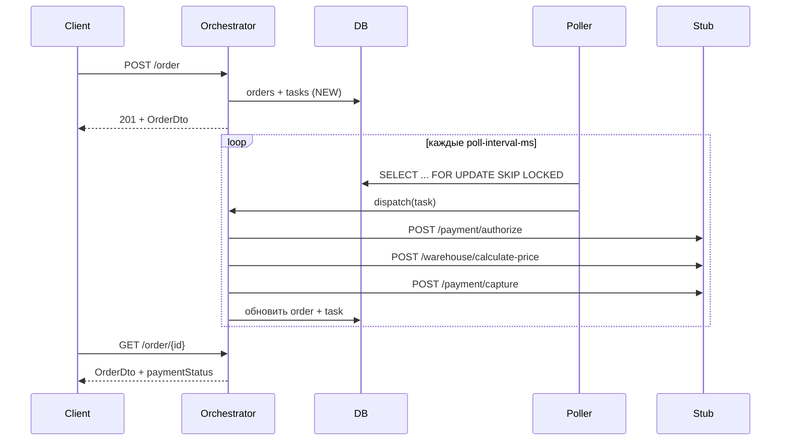

# Order Payment System

Асинхронная система оплаты заказов (AsyncRunner 2049). Оркестратор принимает заказ, ставит задачу в очередь и в фоне проходит цепочку **AUTH → REPRICE → CAPTURE** через HTTP-стабы платёжного шлюза и склада.

## Модули

| Модуль | Назначение |
|--------|------------|
| [`common-libs`](common-libs/README.md) | Общие DTO и enum'ы для платежей и пересчёта цены |
| [`order-orchestrator`](order-orchestrator/README.md) | REST API заказов, poller/dispatcher и оркестрация оплаты |
| [`payment-stub`](payment-stub/README.md) | HTTP-стабы `/payment/*` и `/warehouse/*` с настраиваемым поведением |

## Как это работает



1. **Создание заказа** — `POST /order` сохраняет заказ со статусом `NEW` и создаёт задачу в таблице `tasks`.
2. **Poller** — по расписанию забирает задачи в статусах `NEW`, `FAILED_RETRYABLE`, `IN_PROGRESS` (с учётом `next_attempt_at`) и помечает их `IN_PROGRESS`.
3. **Dispatcher** — выполняет задачу в thread pool и по результату переводит её в `SUCCEEDED`, `FAILED_RETRYABLE` или `FAILED_NON_RETRYABLE`.
4. **Processor** — последовательно вызывает authorize → calculate-price → capture; при отказе на любом шаге обновляет `paymentStatus` заказа.

## Требования

- Docker Desktop (Compose v2).
- JDK 21 — для локального запуска сервисов без Docker.

## Режим разработки (IntelliJ IDEA)

1. Убедись, что Docker Desktop запущен.
2. Подними инфраструктуру:
   ```bash
   docker compose -f order-orchestrator/docker-compose.dev.yaml up --build
   ```
3. Запусти `order-orchestrator` из IntelliJ IDEA.

   Переменные окружения по умолчанию:

   | Переменная | Значение |
   |------------|----------|
   | `SPRING_DATASOURCE_URL` | `jdbc:postgresql://localhost:5432/orders` |
   | `SPRING_DATASOURCE_USERNAME` | `user` |
   | `SPRING_DATASOURCE_PASSWORD` | `pass` |
   | `STUB_BASE_URL` | `http://localhost:8081/` |

   При необходимости переопредели их в конфигурации запуска.

## Полный стек (одна команда)

```bash
docker compose -f infra/docker-compose.dev.yaml up --build
```

Порты по умолчанию: оркестратор `http://localhost:8080`, стаб `http://localhost:8081`, Postgres `localhost:5432`.

> В `infra/docker-compose.dev.yaml` для стаба задана переменная `PAYMENT_STUB_URL`; в `application.yml` оркестратора используется `STUB_BASE_URL`. Для полного стека задай `STUB_BASE_URL=http://payment-stub:8081/` в секции `order-orchestrator`.

## Локальный запуск сервисов без Docker

macOS/Linux:

```bash
./gradlew :order-orchestrator:bootRun
./gradlew :payment-stub:bootRun
```

Windows PowerShell:

```powershell
.\gradlew.bat :order-orchestrator:bootRun
.\gradlew.bat :payment-stub:bootRun
```

## API (кратко)

**Создать заказ**

```http
POST /order
Content-Type: application/json

{
  "address": "Москва, ул. Примерная, 1",
  "clientEstimate": 5000.00,
  "customerId": 42
}
```

**Получить заказ**

```http
GET /order/{id}
```

Ответ содержит `paymentStatus`: `NEW`, `AUTHORIZED`, `SUCCEED_PAID`, `AUTHORIZATION_FAILED`, `PRICE_CHANGED_FAILED`, `CAPTURE_FAILED`, а также суммы и `failureReason` при ошибке.

Подробнее — в [order-orchestrator/README.md](order-orchestrator/README.md).

## Конфигурация оркестратора

| Параметр | Env | По умолчанию |
|----------|-----|--------------|
| Интервал poller'а | `TASK_EXEC_POLL_INTERVAL_MS` | `10000` |
| Размер батча | `TASK_EXEC_POLL_BATCH_SIZE` | `10` |
| URL стаба | `STUB_BASE_URL` | `http://localhost:8081/` |
| Задержка retry | `task-execution.dispatcher.retry-delay` | `20s` |
| Макс. попыток | `task-execution.dispatcher.max-attempts` | `5` |
| Thread pool | `task-execution.dispatcher.thread-pool-size` | `10` |

## Swagger UI

- Оркестратор: `http://localhost:8080/swagger-ui/index.html`
- Payment Stub: `http://localhost:8081/swagger-ui/index.html`

## Compose-команды

Старт общего стека (с пересборкой):

```bash
docker compose -f infra/docker-compose.dev.yaml up --build
```

Остановка с удалением контейнеров/сетей (тома остаются):

```bash
docker compose -f infra/docker-compose.dev.yaml down
```

Полное удаление с томами:

```bash
docker compose -f infra/docker-compose.dev.yaml down -v
```

Просмотр логов:

```bash
docker compose -f infra/docker-compose.dev.yaml logs -f
```
